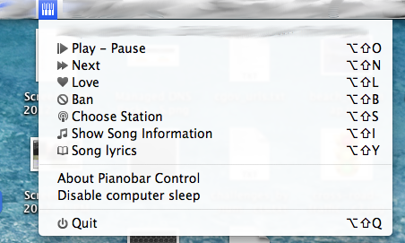
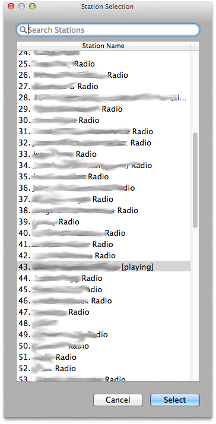

PianobarControl
===============

This is a wrapper around [pianobar](https://github.com/PromyLOPh/pianobar) for
OS X. It currently depends on an appropriate `eventcmd` to be set in
`$HOME/.config/pianobar/config` (I use [pianobar-notify-osx](https://github.com/jcmuller/pianobar-notify).

There is a global hot key: `Shift + Option + P`

The source can be browsed [here](https://github.com/jcmuller/PianobarControl).

A built binary [here](releases/PianobarControl-0.5.zip).

### Screen shots:

